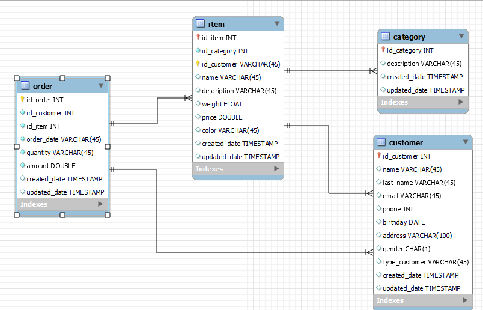
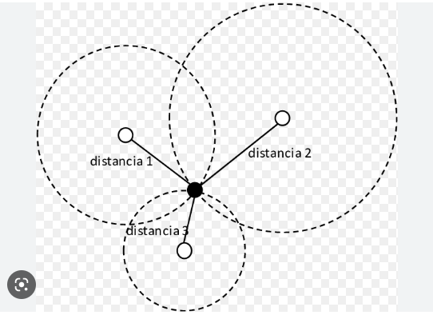
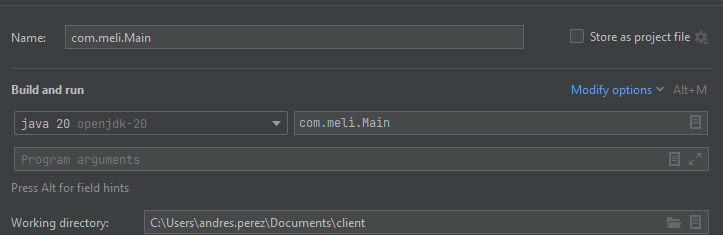
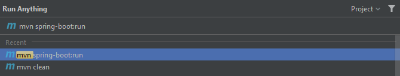
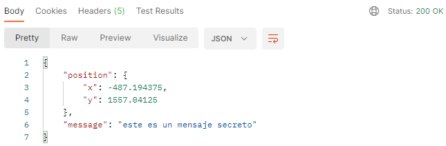
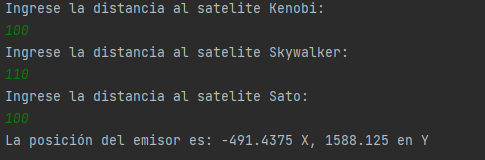

# **MeliChallenge**
## **Challenge BI**
### **REQUERIMIENTOS**

Teniendo en cuenta el modelo de ecommerce que se maneja en ela entidad, se solicita crear una solución que resuelva las siguientes necesidades: 
* Se necesita la cantidad de ventasrealizadas, el producto más vendido y el monto total
transaccionado por cada mes del 2022.
* Se solicita si es posible poblar una tabla con el precio , mail de usuario , fecha de baja y estado
de los Items a fin del día .
a. Vale resaltar que en la tabla Item, vamos a tener únicamente el último estado
informado por la PK definida.
b. Esta información nos va a permitir realizar análisis para entender el
comportamiento de los diferentes Items (por ejemplo evolución de Precios,
cantidad de Items activos).
* Desde IT nos comentan que la tabla de Categorías tiene un issue ya que cuando generan
modificaciones de una categoría se genera un nuevo registro con la misma PK en vez de actualizar el ya existente. Teniendo en cuenta que tenemos una columna de Fechade
LastUpdated, se solicita crear una nueva tabla y poblar la misma sin ningún tipo de
duplicados garantizando la calidad y consistencia de los datos.

### **DESARROLLO**
#### **Modelo Relacional**


Para el modelo dimensional se crearon 4 tablas que son las siguientes:

* **Customer:** Es la entidad donde se encuentran todos nuestros usuarios, ya sean Buyers o Sellers
del Site. Los principales atributos son email, nombre, apellido, sexo, dirección, fecha de
nacimiento, teléfono, entre otros.

* **Item:** Es la entidad donde se encuentran los productos publicados en nuestro
marketplace. El volumen es muy grande debido a que se encuentran todos los productos que en
algún momento fueron publicados. Mediante el estado del ítem o fecha de baja se puede detectar
los ítems activos del marketplace.

* **Category:** Es la entidad donde se encuentra la descripción de cada categoría con su respectivo path. Cada ítem tiene asociado una categoría.

* **Order:**  La order es la entidad que refleja las transacciones generadas dentro del site (cada compra es una order).

### **Preguntas de negocio**

 * Primera respuesta de negocio [codigo](https://github.com/andresfpc11/MeliChallenge/blob/main/db/respuestas_negocio.sql#L1) <BR><BR>
Se construyen unas subconsultas, para lograr llegar al resultado esperado de esta solucion, en la primera subconsulta llamada **"producto_vendido"** se toman los datos de la tabla "order", alli se utiliza una funcion de ventana la cual realiza una particion por  el mes registrado en el campo **"order_date"** y se realiza un conteo del campo **"id_item"** con esto obtiene el total de transacciones por item durante cada uno de los meses. Para finalizar se realiza el filtro por el año deseado en este caso **"2022"** y status 
**"complete"**.<BR><BR>
La segunda subconsulta llamada **"total_ventas"** busca traer la informacion del total de ventas realizadas de y el total transaccionado por cada mes del año deseado en este caso **"2022"** <BR>
<BR>
Para finalizar se realiza un join de las subconsultas por los campos **"MES"** se seleccionan los campos, **"Mes"**,**"Total_Transacciones"**,**"Total_Ventas"**,**"Producto"** y para finalizar se hace un filtro por la particion generada para seleccionar el item mas vendido en cada mes.
```sql
with 
producto_vendido as (
    select	
        id_item,
        name as Producto,
        month(order_date) as Mes,
        count(id_item) as Total_Transacciones,
        row_number() over (partition by month(order_date) order by count(id_item) desc ) as Numero
    from 
        mydb.order
    where 
        YEAR(order_date)=2022 and 
        status = "completed" 
    group by 1,2
    order by 2,3
), 
total_ventas as	(
    select	
        month(o.order_date) as Mes,
        count(o.id_order) as Total_Transacciones, 
        sum(i.price) as Total_Ventas	
    from 
        mydb.order as o
        inner join mydb.item as i on o.id_item = i.id_item
    where 
        YEAR(o.order_date)=2022 and 
        o.status = "completed" 
    group by 1
) 
select 
    Mes,
    tv.Total_Transacciones,
    tv.Total_Ventas,
    pv.Producto
from 
	total_ventas as tv 
    join producto_vendido as pv on tv.Mes = pv.Mes
where pv.numero=1 
```

 * Segunda respuesta de negocio [codigo](https://github.com/andresfpc11/MeliChallenge/blob/main/db/respuestas_negocio.sql#L41) <BR><BR>
 Se realiza un proceso almacenado llamado **"procedure_daily_item"** donde se pobla una tabla llamada **"dailyitem"** esta tabla toma la informacion de las tablas **"item"** y **"customer"**. Alli se filtra la informacion del dia anterior y esta es la data que como resultado terminara poblando la tabla **"procedure_daily_item"**.
```sql
--Segunda respuesta de negocio
CREATE PROCEDURE `procedure_daily_item`()
BEGIN
INSERT INTO mydb.dailyitem
(id_item, nombre_producto, cliente, nombre_cliente, price, status, email, end_date, created_date, updeted_date)
select  
	item.id_item,
    item.name as nombre_producto,
    customer.id_customer as cliente,
    customer.name as nombre_cliente,
	item.price,
    item.status,
    customer.email,
    item.end_date,
    now() as created_date,
    now() as updated_date
from mydb.item join mydb.customer
	on item.id_customer= customer.id_customer
where date(item.updated_date) >= date_add(current_date(),INTERVAL -1 DAY);
END
```
* tercera respuesta de negocio [codigo](https://github.com/andresfpc11/MeliChallenge/blob/main/db/respuestas_negocio.sql#L62) <BR><BR>

Se realiza una funcion de ventana con la cual generamos una particion por **"id_category"** ordenamos por **"update_date"** y filtramos por particion para obtener el ultimo dato actualizado en la tabla **"category"** para finalizar poblamos la nueva tabla **"category_1"** con la informacion obtenida
```sql
--Tercera respuesta de negocio
INSERT INTO mydb.category_1(id_category,description,created_date,updated_date)(
SELECT id_category,
       description,
       created_date,
       updated_date
FROM
  (SELECT *,
          row_number() OVER (PARTITION BY id_category
                             ORDER BY updated_date DESC) AS dato
   FROM mydb.category) AS tabla
WHERE dato=1
)
```

## **Challenge BI**
### **REQUERIMIENTOS**

Como jefe de comunicaciones rebelde, tu misión es crearun programa en Python (o algún
lenguaje moderno que prefieras) que retorne la fuente y contenido del mensaje de auxilio. Para
esto, cuentas con tres satélites que te permitirán triangular la posición, ¡pero cuidado! El mensaje
puede no llegar completo a cada satélite debido al campo de asteroides frente a la nave.<BR><BR>
Posición de los satélites actualmente en servicio:
* Kenobi: [-500, -200]
* Skywalker: [100, -100]
* Sato: [500, 100]

### **Ecuaciones**
Para dar solucion a este reto se usan las ecuaciones de trilateración. La trilateración es un método matemático para determinar las posiciones relativas de objetos usando la geometría de triángulos de forma análoga a la triangulación.



Alli se busca la interseccion de como minimo 3 circunferencias para hallar un unico punto resultante. Para ello se usa la ecuacion base de una circunferencia en un plano 2D.

$$(x-a)^2 + (y-b)^2=r^2$$

reemplazando por cada uno de los satelites nos quedan las ecuaciones de la siguiente manera:
$$(x-x_1)^2 + (y-y_1)^2=r_1^2$$
$$(x-x_2)^2 + (y-y_2)^2=r_2^2$$
$$(x-x_3)^2 + (y-y_3)^2=r_3^2$$

Expandiendo los cuadrados las ecuaciones quedan asi:
 1. $$x^2-2x_1x+x_1^2+y^2-2y_1y+y_1^2=r_1^2$$
 2. $$x^2-2x_2x+x_2^2+y^2-2y_2+y_2^2=r_2^2$$  
 3. $$x^2-2x_3x+x_3^2+y^2-2y_3y+y_3^2=r_3^2$$

 Restamos la ecuacion 2 de la 1 simplificando quedaria de la siguiente manera:

4. $$x(-2x_1+2x_2)+y(-2y_1+2y_2)=r_1^2 -r_2^2-x_1^2+x_2^2-y_1^2+y_2^2$$

Ahora restamos la ecuacion 3 de 2 simplificando quedaria asi:

5. $$x(-2x_2+2x_3)+y(-2y_2+2y_3)=r_2^2 -r_3^2-x_2^2+x_3^2-y_2^2+y_3^2$$

Haciendo uso de un sistema de solucion de ecuaciones de segundo grado quedaria de la siguiente forma:
 $$Jx+Ky=L$$
 $$Mx+Ny=O$$

La solucion para las cordenadas quedaria de la siguiente forma:

6. $$x=(LN-OK)/ (NJ-KM)$$
7. $$y=(LM-JO)/ (KM-JN)$$

Las constantes a calcular serian:

* $$J=(-2x_1+2x_2)$$
* $$K=(-2y_1+2y_2)$$
* $$L=r_1^2-r_2^2-x_1^2+x_2^2-y_1^2+y_2^2$$
* $$M=(-2x_2+2x_3)$$
* $$N=(-2y_2+2y_3)$$
* $$O=r_2^2-r_3^2-x_2^2+x_3^2-y_2^2+y_3^2$$
### **Instrucciones de uso**

1. Clonar el repositorio<BR>
```https://github.com/andresfpc11/MeliChallenge.git```

2. Como correr client<BR>
```run main class```

3. Como correr Api <BR>
ejecutar ```mvn spring-boot:run```


4. Resultados:<BR>
Api: 

Client:



### **TO DO**
* Test unitarios
* Diagrama UML
* Tokenizar Api
